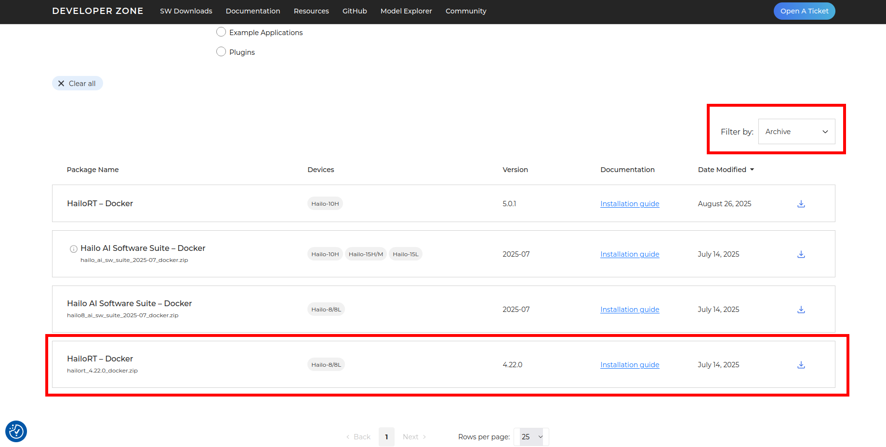

# Hailo-8 License Plate Detection (LPD)

This repository contains a **License Plate Detection (LPD) library** built for the **Hailo-8 AI accelerator**, along with a simple yet powerful application to test it in real time.

With this library you can:

* 🚗 Detect license plates from vehicle videos in real time
* ⚡ Run fast inference directly on Hailo-8 hardware
* 🖥️ Use either a **command-line tool** or a **user-friendly GUI**

---

## ✅ Prerequisites

To use this library you must have **Hailo-8 drivers (HailoRT) v4.20.0** and the **Hailo AI Software Suite** already installed.

We strongly recommend following RidgeRun’s guide and using the **Docker method**, which ships several required binaries prebuilt:

* RidgeRun blog: **Hailo-8 on x86 — First Steps**
  [https://www.ridgerun.ai/post/hailo-8-x86-first-steps](https://www.ridgerun.ai/post/hailo-8-x86-first-steps)

> **Strict version requirement for this demo:**
> Use the **2025-01** release of the Hailo AI Software Suite. On the **Hailo Developer Zone** downloads page, you **must** change **“Filter by: Archive”** to locate that specific release. If you skip this, the required version will not appear.



---

## 🌍 Environment Setup

The project relies on the **TAPPAS workspace**, which is the directory where you have the **TAPPAS repository** cloned.

To simplify usage across commands, define it as an environment variable:

```bash
export TAPPAS_WORKSPACE=/local/workspace/tappas
```

* If you are using the **official Hailo container** (`hailo_ai_sw_suite_docker_run.sh`), the default directory is:

  ```
  /local/workspace/tappas
  ```

* If your TAPPAS repository is located elsewhere, simply update the environment variable to point to that path.

You’ll reuse `$TAPPAS_WORKSPACE` throughout all build and run instructions.

---

## 🚀 LPD Library

### Fix pkg-config (Required Once)

Before building, you need to apply a **one-time fix** for a known issue in the TAPPAS library’s `pkg-config`.
Run the following command:

```bash
$TAPPAS_WORKSPACE/scripts/misc/pkg_config_setup.sh --target-platform x86_64
```

---

### Build & Install the LPD Library

First, install dependencies:

```bash
sudo apt install ninja-build
```

Make sure you are in the root of this repository (the same directory where this README is located).
Then run the following commands to build and install the library:

```bash
cd lpd_lib
meson setup builddir --prefix /opt/hailo/tappas/
ninja -C builddir
sudo ninja -C builddir install
```

---

## 🎥 Run Inference on a Video (Terminal)

Make sure you are in the **root of this repository** (the same directory where this README is located).

The script takes two arguments:

```bash
Usage:
    ./bin/apply_lpd_to_video <input_video> <output_video>
```

### Example

Apply license plate detection to the included demo video:

```bash
./bin/apply_lpd_to_video \
    ./lpd_app/gui/assets/video_example.mp4 \
    output.mp4
```

This will process the input video and generate a new MP4 file with license plate detection results.

---

## 💻 LPD App (GUI)

For a more interactive workflow, use the **Python-based GUI application**.

### Installation

```bash
pip3 install -r requirements.txt
pip3 install .
```

---

### Launch the GUI

Run the graphical interface with:

```bash
./bin/run_gui
```

(make sure `$TAPPAS_WORKSPACE` is set in your environment).
