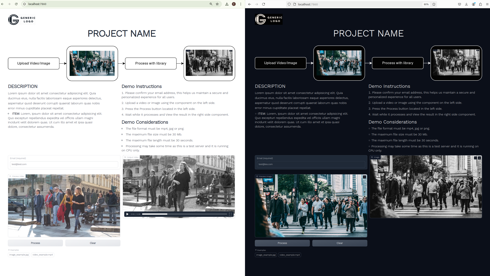

# Application Web Model Server

> Apply a transformation to an input video using the application library.

## Important Note

If your application uses machine learning models that require a GPU, you might want to consider using the serverless solution from Modelbit. If this applies to your case, create a new repository from this template but make sure to select the option to clone all branches:


- Now in your repository, switch to the "modelbit" branch:

```bash
git checkout modelbit
```

- For more information on how to use Modelbit to host your models, follow this guide: [Modelbit Guide](https://github.com/ridgerun-ai/modelbit)

## Installing the Project

Install the python project and the python required dependencies.

```shell
pip3 install -r requirements.txt
pip3 install .
```

Install 3rd dependencies:
```shell
sudo apt update && sudo apt upgrade
sudo apt install ffmpeg
```

## Apply transformation to video

To apply transformation to video, run this command:

```shell
./bin/apply_to_video -i data/people_walking.mp4 -o data/people_walking_transformed.mp4
```

## Apply transformation to image

To apply transformation to image, run this command:

```shell
./bin/apply_to_image -i data/seven_faces.png -o data/seven_faces_transformed.png
```

## Launch the user interface

To launch the user interface, run this command:

```shell
./bin/run_gui
```

## How to set up Gradio Web Model Demo

### Customize visual content

Note 1: Due to the limitations of Gradio components in customizing visual content, HTML and CSS are used for some parts.

Note 2: Gradio uses dark mode and light mode automatically and cannot be disabled which implies the need to have assets for both themes.

#### Font Style

To modify the font, open the file `web_model_server/gui/assets/product_info.css` and change the `font-family` property of the following field:

``` css
* {
  font-family: 'WorkSans', Arial, sans-serif;
}
```

#### Tab Title Name

This is the name that will be seen in the browser tab, to change the title name, modify the `TITLE_NAME` variable in the file `web_model_server/gui/app.py` 

#### Tab Icon

To add a new tab icon you must copy the image in the directory `web_model_server/gui/assets` with the name `icon.png`

#### Dark and Light Mode

This interface has the ability to change between light and dark model, as shown below:

<div align="center"></div>

#### Logo

To add a new logo you must copy the images for the dark and light mode in the directory `web_model_server/gui/assets` with the names `dark_logo.png` and `light_logo.png`

To modify the size of the logos or apply your own styles, modify the html `web_model_server/gui/assets/product_info.html` in the section` <!-- Logo -->`

Note: if you want to use different names for the logos you must modify the path in the HTML and you must also add the paths to the file `web_model_server/gui/app.py` (the last lines), in the the `allowed_paths` argument of the `demo.launch()` method.

#### Product Title Name

This is the title shown on the page, to modify the Product Title Name open file `web_model_server/gui/assets/product_info.html` and modify section `<!-- Product Title Name -->`

#### Product Diagram Image

To add a new product diagram image you must copy the images for the dark and light mode in the directory `web_model_server/gui/assets` with the names `dark_diagram.png` and `ligh_diagram.png`

To modify the size of the diagram's images or apply your own styles, modify the html `web_model_server/gui/assets/product_info.html` in the section `<!-- Product Diagram Image -->`

Note: if you want to use different names for the diagram’s you must modify the path in the HTML and you must also add the paths to the file `web_model_server/gui/app.py` (the last lines), in the the `allowed_paths` argument of the `demo.launch()` method.

#### Product Description

To modify the Product Description open file `web_model_server/gui/assets/product_info.html` and modify section `<!-- Product Description -->`

### Modify demo limitations

#### Max Upload File Size

To set the upload file size limit, modify the `MAX_FILE_SIZE` variable in the file `web_model_server/gui/app.py`

#### Max Upload Video Length

To set the upload video length limit, modify the `MAX_VIDEO_LENGHT` variable in the file `web_model_server/gui/app.py`

#### Supported Upload Files

To set the supported upload files formats modify the `SUPPORTED_VIDEO_FORMATS` and `SUPPORTED_IMAGE_FORMATS` lists in the file `web_model_server/gui/app.py`

### Modify process algorithm

For processing, you must modify the `image.py` and `video.py` files located in the folder `web_model_server/algorithm `

The apply methods in the module `image.py` and `video.py` receive the input file path and the output file path as parameters, this method must perform the processing on the input file path and save the result in the output file path

#### About the watermark

The `image.py` and `video.py` "apply" methods use a watermark processor which applies the RidgeRun ai watermark to the output, if you want to change this watermark you must replace the file `web_model_server/assets/rr_watermark.png`

If you do not want to apply the watermark, you only have to remove the lines where the WatermarkProcessor is used:

``` python
# Create the watermark processor
self.watermarkProcessor = WatermarkProcessor(input_width, input_height)

# Add watermark to the image
processed_frame = self.watermarkProcessor.apply_watermark_to_image(processed_frame)
```

#### Add your custom examples
To add examples upload the files to the folder `web_model_server/gui/assets` and then add the paths into a list in the file `web_model_server/gui/app.py` in the `EXAMPLES` variable as shown below:

``` python
EXAMPLE_IMAGE1 = ['web_model_server/gui/assets/image_example.jpg']
EXAMPLE_VIDEO1 = ['web_model_server/gui/assets/video_example.mp4']
EXAMPLES = [EXAMPLE_IMAGE1, EXAMPLE_VIDEO1]
```

Note: The path must be inside square parentheses!
# Docker Container

This project have been create with the ability to containerize your application. On the [Docker Instructions](docker/README.md) section you can find a template Dockerfile and a demo showing how to deploy your application to a Linux instance with Docker.
